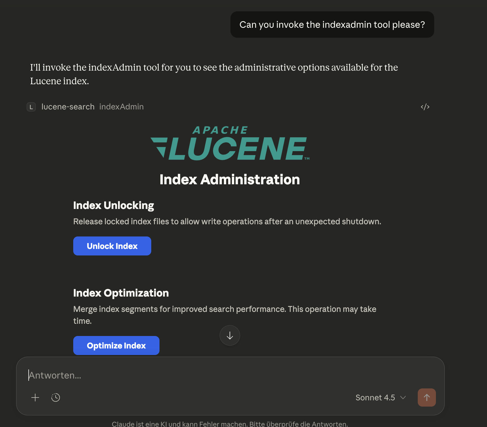

# MCP Lucene Server

[](https://github.com/mirkosertic/MCPLuceneServer/actions/workflows/build.yml)

A Model Context Protocol (MCP) server that exposes Apache Lucene fulltext search capabilities with automatic document crawling and indexing. This server uses STDIO transport for communication and can be integrated with Claude Desktop or any other MCP-compatible client.

## Features

✨ **Automatic Document Crawling**
- Automatically indexes PDFs, Microsoft Office, and OpenOffice documents
- Multi-threaded crawling for fast indexing
- Real-time directory monitoring for automatic updates
- Incremental indexing with full reconciliation (skips unchanged files, removes orphans)

🔍 **Powerful Search**
- Full Lucene query syntax support (wildcards, boolean operators, phrase queries)
- Field-specific filtering (by author, language, file type, etc.)
- Structured passages with quality metadata for LLM consumption
- Paginated results with filter suggestions

🔬 **Query Profiling & Debugging**
- Deep query analysis and profiling (`profileQuery` tool)
- Understand why queries return certain results and how scoring works
- Filter impact analysis showing document reduction per filter
- Document scoring explanations with BM25 breakdown
- Term statistics (IDF, rarity, document frequency)
- Actionable optimization recommendations
- LLM-optimized structured output for easy interpretation

📄 **Rich Metadata Extraction**
- Automatic language detection
- Author, title, creation date extraction
- File type and size information
- SHA-256 content hashing for change detection

🧹 **Text Normalization**
- Automatic removal of broken/invalid characters (�, control chars, zero-width chars)
- Whitespace normalization (multiple spaces collapsed to single space)
- Ensures clean, readable search results and passages

⚡ **Performance Optimized**
- Batch processing for efficient indexing
- NRT (Near Real-Time) search with dynamic optimization
- Configurable thread pools for parallel processing
- Progress notifications during bulk operations

🔧 **Easy Integration**
- STDIO transport for seamless MCP client integration
- Comprehensive MCP tools for search and crawler control
- Flexible configuration via YAML
- Cross-platform notifications (macOS Notification Center, Windows Toast, Linux notify-send)

## Table of Contents

- [Quick Start](#quick-start)
- [Configuration Options](#configuration-options)
  - [Document Crawler Configuration](#document-crawler-configuration)
- [Available MCP Tools](#available-mcp-tools)
- [Index Field Schema](#index-field-schema)
- [Document Crawler Features](#document-crawler-features)
- [Usage Examples](#usage-examples)
- [Troubleshooting](#troubleshooting)
- [Development](#development)
  - [Running for Development](#running-for-development)
  - [Debugging with MCP Inspector](#debugging-with-mcp-inspector)
  - [Adding Documents to the Index](#adding-documents-to-the-index)

## Quick Start

Get up and running with MCP Lucene Server in three steps.

### Prerequisites

- **Java 21 or later** - Required to run the server
- Maven 3.9+ (only if building from source)

### Step 1: Get the Server

**Option A: Download Pre-built JAR (Recommended)**

1. Go to the [Actions tab](https://github.com/mirkosertic/MCPLuceneServer/actions/workflows/build.yml)
2. Click on the most recent successful workflow run
3. Scroll down to "Artifacts" and download `luceneserver-X.X.X-SNAPSHOT`
4. Extract the ZIP file to get the JAR

For tagged releases, you can also download from the [Releases page](https://github.com/mirkosertic/MCPLuceneServer/releases).

**Option B: Build from Source**

```bash
./mvnw clean package -DskipTests
```

This creates an executable JAR at `target/luceneserver-0.0.1-SNAPSHOT.jar`.

### Step 2: Configure Claude Desktop

Locate your Claude Desktop configuration file:
- **macOS**: `~/Library/Application Support/Claude/claude_desktop_config.json`
- **Windows**: `%APPDATA%\Claude\claude_desktop_config.json`
- **Linux**: `~/.config/Claude/claude_desktop_config.json`

Add the Lucene MCP server to the `mcpServers` section:

```json
{
  "mcpServers": {
    "lucene-search": {
      "command": "java",
      "args": [
        "--enable-native-access=ALL-UNNAMED",
        "-Xmx2g",
        "-Dspring.profiles.active=deployed",
        "-jar",
        "/absolute/path/to/luceneserver-0.0.1-SNAPSHOT.jar"
      ]
    }
  }
}
```

**Important:** Replace `/absolute/path/to/luceneserver-0.0.1-SNAPSHOT.jar` with the actual absolute path to your JAR file.

The `-Dspring.profiles.active=deployed` flag is required for clean STDIO communication (disables console logging, web server, and startup banner).

### Step 3: Start Using It

1. **Restart Claude Desktop** to load the new configuration
2. **Verify** the server is running in Claude Desktop's developer settings
3. **Tell Claude** to add your documents:

```
"Add /Users/yourname/Documents as a crawlable directory and start crawling"
```

That's it! The configuration is saved to `~/.mcplucene/config.yaml` and persists across restarts. You can now search your documents through Claude.

**Example searches:**
- "Search for machine learning papers"
- "Find all PDFs by John Doe"
- "What documents mention quarterly reports?"

## Configuration Options

> **Note:** The [Quick Start](#quick-start) above uses zero-configuration. This section covers advanced customization options.

The server can be configured via environment variables and `application.yaml`:

### Logging Profiles

The server supports two logging profiles (for backwards compatibility, uses the same system property as Spring Boot):

| Profile | Usage | Logging Output |
|---------|-------|---------------|
| **default** | Development in IDE | Console logging enabled |
| **deployed** | Production/Claude Desktop | File logging only |

**Default profile (no profile specified):**
- Full logging enabled to console
- Suitable for debugging and development

**Deployed profile (`-Dspring.profiles.active=deployed`):**
- Console logging disabled (required for STDIO transport)
- File logging enabled (`~/.mcplucene/log/mcplucene.log`)
- Used when running under Claude Desktop or other MCP clients

### Environment Variables

| Environment Variable | Default                                | Description |
|---------------------|----------------------------------------|-------------|
| `LUCENE_INDEX_PATH` | `${user.home}/.mcplucene/luceneindex}` | Path to the Lucene index directory |
| `LUCENE_CRAWLER_DIRECTORIES` | none                                   | Comma-separated list of directories to crawl (overrides config file) |
| `SPRING_PROFILES_ACTIVE` | none (default)                         | Set to `deployed` for production use |

**Note on `LUCENE_CRAWLER_DIRECTORIES`:**
When this environment variable is set, it takes precedence over `~/.mcplucene/config.yaml` and `application.yaml`. The MCP configuration tools (`addCrawlableDirectory`, `removeCrawlableDirectory`) will refuse to modify configuration while this override is active. To use runtime configuration, remove this environment variable.

### Document Crawler Configuration

The crawler directories can be configured in three ways, with the following priority (highest to lowest):

1. **Environment Variable**: `LUCENE_CRAWLER_DIRECTORIES` (comma-separated paths)
2. **Runtime Configuration**: `~/.mcplucene/config.yaml` (managed via MCP tools)
3. **Application Default**: `src/main/resources/application.yaml`

#### Runtime Configuration via MCP Tools (Recommended)

The server provides MCP tools to manage crawlable directories at runtime without editing configuration files:

**`listCrawlableDirectories`** - List all configured directories
```
Ask Claude: "What directories are being crawled?"
```

**`addCrawlableDirectory`** - Add a new directory to crawl
```
Ask Claude: "Add /Users/yourname/Documents as a crawlable directory"
Ask Claude: "Add /path/to/folder and start crawling it immediately"
```

**`removeCrawlableDirectory`** - Remove a directory from crawling
```
Ask Claude: "Stop crawling /Users/yourname/Downloads"
```

**Benefits of Runtime Configuration:**
- No need to rebuild the JAR or restart the server
- Configuration persists across restarts in `~/.mcplucene/config.yaml`
- Easy to distribute pre-built JARs
- Conversational interface via Claude

**Configuration File Location:**
```
~/.mcplucene/config.yaml
```

**Example config.yaml:**
```yaml
lucene:
  crawler:
    directories:
      - /Users/yourname/Documents
      - /Users/yourname/Downloads
```

#### Static Configuration via application.yaml

Configure the document crawler in `src/main/resources/application.yaml`:

```yaml
lucene:
  index:
    path: ${LUCENE_INDEX_PATH:./lucene-index}
  crawler:
    # Directories to crawl and index
    directories:
      - "/path/to/your/documents"
      - "/another/path/to/index"

    # File patterns to include
    include-patterns:
      - "*.pdf"
      - "*.doc"
      - "*.docx"
      - "*.odt"
      - "*.ppt"
      - "*.pptx"
      - "*.xls"
      - "*.xlsx"
      - "*.ods"
      - "*.txt"
      - "*.eml"
      - "*.msg"
      - "*.md"
      - "*.rst"
      - "*.html"
      - "*.htm"
      - "*.rtf"
      - "*.epub" 

    # File patterns to exclude
    exclude-patterns:
      - "**/node_modules/**"
      - "**/.git/**"
      - "**/target/**"
      - "**/build/**"

    # Performance settings
    thread-pool-size: 4                    # Parallel crawling threads
    batch-size: 100                        # Documents per batch
    batch-timeout-ms: 5000                 # Batch processing timeout

    # Directory watching
    watch-enabled: true                    # Monitor directories for changes
    watch-poll-interval-ms: 2000          # Watch polling interval

    # NRT optimization
    bulk-index-threshold: 1000            # Files before NRT slowdown
    slow-nrt-refresh-interval-ms: 5000    # NRT interval during bulk indexing

    # Content extraction
    max-content-length: -1                 # -1 = unlimited, or max characters
    extract-metadata: true                 # Extract author, title, etc.
    detect-language: true                  # Auto-detect document language

    # Auto-crawl
    crawl-on-startup: true                 # Start crawling on server startup

    # Progress notifications
    progress-notification-files: 100       # Notify every N files
    progress-notification-interval-ms: 30000  # Or every N milliseconds

    # Incremental indexing
    reconciliation-enabled: true           # Skip unchanged files, remove orphans (default: true)

    # Search passages
    max-passages: 3                        # Max highlighted passages per search result (default: 3)
    max-passage-char-length: 200           # Max character length per passage; longer ones are truncated (default: 200, 0 = no limit)
```

**Supported File Formats:**
- PDF documents (`.pdf`)
- Microsoft Office: Word (`.doc`, `.docx`), Excel (`.xls`, `.xlsx`), PowerPoint (`.ppt`, `.pptx`)
- OpenOffice/LibreOffice: Writer (`.odt`), Calc (`.ods`), Impress (`.odp`)
- Plain text files (`.txt`)
- Email: Outlook (`.msg`), EML (`.eml`)
- Markup: Markdown (`.md`), reStructuredText (`.rst`), HTML (`.html`, `.htm`)
- Rich Text Format (`.rtf`)
- E-books: EPUB (`.epub`)

**Complete Configuration Example:**

```yaml
lucene:
  index:
    path: /Users/yourname/lucene-index
  crawler:
    # Add your document directories here
    directories:
      - "/Users/yourname/Documents"
      - "/Users/yourname/Downloads"
      - "/Volumes/ExternalDrive/Archive"

    # Include only these file types
    include-patterns:
      - "*.pdf"
      - "*.docx"
      - "*.xlsx"

    # Exclude these directories
    exclude-patterns:
      - "**/node_modules/**"
      - "**/.git/**"

    # Performance tuning
    thread-pool-size: 8              # Use more threads for faster indexing
    batch-size: 200                  # Larger batches for better throughput

    # Auto-start crawler
    crawl-on-startup: true

    # Real-time monitoring
    watch-enabled: true

    # No content limit (index full documents)
    max-content-length: -1
```

## Available MCP Tools

**Quick Reference - Most Important Tools:**
- 🔍 **`search`** - Search documents with full Lucene query syntax and structured filters
- 🔬 **`profileQuery`** - Debug and optimize queries with detailed analysis and scoring explanations
- 🗂️ **`indexAdmin`** - Visual UI for index maintenance (optimize, purge, unlock)
- 📊 **`getIndexStats`** - View index statistics and document count
- 🚀 **`startCrawl`** - Index documents from configured directories

---

### `indexAdmin`

An [MCP App](https://github.com/modelcontextprotocol/ext-apps) that provides a visual user interface for index maintenance tasks directly inside your MCP client (e.g. Claude Desktop). When invoked, the app is rendered inline in the conversation and offers one-click access to administrative operations without requiring manual tool calls.



**Available actions:**

- **Unlock Index** -- Removes a stale `write.lock` file after an unclean shutdown (equivalent to calling `unlockIndex` with `confirm=true`)
- **Optimize Index** -- Merges index segments for improved search performance (equivalent to calling `optimizeIndex`)
- **Purge Index** -- Deletes all documents from the index (equivalent to calling `purgeIndex` with `confirm=true`)

Each action shows inline status feedback (success, error, or progress details) directly in the app UI.

**Example:**
```
Ask Claude: "Can you invoke the indexAdmin tool please?"
```

### `search`

Search the Lucene fulltext index using **lexical matching** (exact word forms only).

**Parameters:**
- `query` (optional): The search query using Lucene query syntax. Can be `null` or `"*"` to match all documents (useful with filters).
- `filters` (optional): Array of structured filters for precise field-level filtering (see **Structured Filters** below)
- `page` (optional): Page number, 0-based (default: 0)
- `pageSize` (optional): Results per page (default: 10, max: 100)
- `sortBy` (optional): Sort field - `_score` (default), `modified_date`, `created_date`, or `file_size`
- `sortOrder` (optional): Sort order - `asc` or `desc` (default: `desc`)

**Sorting Results:**

By default, results are sorted by relevance score (most relevant first). You can sort by metadata fields:

| Sort Field | Description | Default Order |
|------------|-------------|---------------|
| `_score` | Relevance score (default) | Descending (best match first) |
| `modified_date` | Last modified date | Descending (most recent first) |
| `created_date` | Creation date | Descending (most recent first) |
| `file_size` | File size in bytes | Descending (largest first) |

**Sort Examples:**
```json
// Most recently modified documents
{ "query": "contract", "sortBy": "modified_date", "sortOrder": "desc" }

// Oldest documents first
{ "query": "contract", "sortBy": "created_date", "sortOrder": "asc" }

// Smallest files (for quick review)
{ "query": "summary", "sortBy": "file_size", "sortOrder": "asc" }

// Combine sorting with filters
{
  "query": "*",
  "sortBy": "modified_date",
  "sortOrder": "desc",
  "filters": [
    { "field": "file_extension", "value": "pdf" },
    { "field": "modified_date", "operator": "range", "from": "2024-01-01" }
  ]
}
```

**Note:** When sorting by metadata fields, relevance scores are still computed and used as a secondary sort criterion for tie-breaking.

**Structured Filters:**

The `filters` array accepts objects with these fields:

| Field | Required | Description |
|-------|----------|-------------|
| `field` | yes | Field name to filter on |
| `operator` | no | `eq` (default), `in`, `not`, `not_in`, `range` |
| `value` | for eq/not | Single value for exact match or exclusion |
| `values` | for in/not_in | Array of values (OR semantics within the field) |
| `from` | for range | Range start (inclusive) |
| `to` | for range | Range end (inclusive) |
| `addedAt` | no | Client timestamp — round-tripped in `activeFilters` response |

**Operator reference:**

| Operator | Description | Example |
|----------|-------------|---------|
| `eq` | Exact match (default) | `{field: "language", value: "en"}` |
| `in` | Match any of values | `{field: "file_extension", operator: "in", values: ["pdf", "docx"]}` |
| `not` | Exclude value | `{field: "language", operator: "not", value: "unknown"}` |
| `not_in` | Exclude multiple values | `{field: "language", operator: "not_in", values: ["unknown", ""]}` |
| `range` | Numeric/date range | `{field: "modified_date", operator: "range", from: "2024-01-01", to: "2025-12-31"}` |

**Filterable fields:**
- **Faceted** (DrillSideways): `language`, `file_extension`, `file_type`, `author`, `creator`, `subject`
- **String (exact match)**: `file_path`, `content_hash`
- **Numeric/date (range)**: `file_size`, `created_date`, `modified_date`, `indexed_date`

**Date format:** ISO-8601 — `"2024-01-15"`, `"2024-01-15T10:30:00"`, or `"2024-01-15T10:30:00Z"`

**Filter combination rules:**
- Filters on **different** fields use AND logic
- Multiple `eq` filters or `in` values on the **same** faceted field use OR logic (DrillSideways)
- `not`/`not_in` filters are applied as MUST_NOT clauses

**🤖 AI-Powered Synonym Expansion:**

This server is designed to work with AI assistants like Claude. Instead of using traditional Lucene synonym files, the AI generates context-appropriate synonyms automatically by constructing OR queries.

**Why this is better than traditional synonyms:**
- **Context-aware**: The AI understands your intent and picks relevant synonyms (e.g., "contract" in legal context vs. "contract" in construction)
- **No maintenance**: No need to maintain static synonym configuration files
- **Domain-adaptive**: Works across legal, technical, medical, or casual language automatically
- **Multilingual**: Generates synonyms in any language without configuration

When you ask Claude to "find documents about cars", it automatically searches for `(car OR automobile OR vehicle)` - giving you better results than a static synonym list.

**⚠️ Technical Details (Lexical Matching):**

The index uses a custom `UnicodeNormalizingAnalyzer` built on Lucene's `ICUFoldingFilter`, which provides:
- ✅ Tokenization and lowercasing
- ✅ Unicode normalization (NFKC) -- full-width characters are mapped to their standard equivalents
- ✅ Diacritic folding -- accented characters are mapped to their ASCII base forms (e.g., "ä" → "a", "ö" → "o", "ü" → "u", "ñ" → "n")
- ✅ Ligature expansion -- PDF ligatures are expanded correctly (e.g., the "fi" ligature → "fi", the "fl" ligature → "fl")
- ✅ Efficient leading wildcard queries -- a `content_reversed` field stores reversed tokens, so `*vertrag` is internally rewritten as a trailing wildcard on the reversed field (`gartrev*`), avoiding costly full-index scans
- ✅ Case-insensitive wildcard queries -- wildcard and prefix terms (e.g. `Vertrag*`, `House*`) are automatically lowercased to match the lowercased index tokens, so capitalization does not affect wildcard results
- ❌ No automatic synonym expansion at the index level
- ❌ No phonetic matching (e.g., "Smith" won't match "Smyth")
- ✅ Automatic Snowball stemming for German and English -- morphological variants are found automatically (e.g., "Vertrag" matches "Verträge"/"Vertrages", "contract" matches "contracts"/"contracting"). Exact matches rank highest. Irregular forms (e.g., "ran" ≠ "run") are not unified.

The AI assistant compensates for the remaining limitations by expanding your queries intelligently.

**💡 Best Practices for Better Results:**

1. **Generate Synonyms Yourself:** Use OR to combine related terms:
   - Instead of: `contract`
   - Use: `(contract OR agreement OR deal)`

2. **Use Wildcards for Variations:** Handle different word forms:
   - Instead of: `contract`
   - Use: `contract*` (matches contracts, contracting, contracted)

3. **Leverage Facets:** Use the returned facet values to discover exact terms in the index:
   - Check `facets.author` to find exact author names
   - Check `facets.language` to see available languages
   - Use these exact values for filtering

4. **Combine Techniques:**
   ```
   (contract* OR agreement*) AND (sign* OR execut*) AND author:"John Doe"
   ```

**Supported Query Syntax:**
- Simple terms: `hello world` (implicit AND between terms)
- Phrase queries: `"exact phrase"` (preserves word order)
- Boolean operators: `term1 AND term2`, `term1 OR term2`, `NOT term`
- Trailing wildcard: `contract*` matches contracts, contracting, contracted
- Leading wildcard: `*vertrag` efficiently finds Arbeitsvertrag, Kaufvertrag (optimised via reverse token field)
- Infix wildcard: `*vertrag*` finds both Vertragsbedingungen and Arbeitsvertrag
- Single char wildcard: `te?t` matches test, text
- Fuzzy search: `term~2` finds terms within Levenshtein edit distance 2 (default: 2)
- Proximity search: `"term1 term2"~5` finds terms within 5 words of each other
- Field-specific search: `title:hello content:world`
- Grouping: `(contract OR agreement) AND signed`
- Range queries: `modified_date:[1609459200000 TO 1640995200000]` (timestamps in milliseconds)

**German Compound Word Search:**

German compound words (e.g., "Arbeitsvertrag", "Vertragsbedingungen") can be searched effectively using wildcards:
- `*vertrag` -- finds words ending in "vertrag" (Arbeitsvertrag, Kaufvertrag, Mietvertrag)
- `vertrag*` -- finds words starting with "vertrag" (Vertragsbedingungen, Vertragsklausel)
- `*vertrag*` -- finds words containing "vertrag" anywhere (combines both)

Leading wildcard queries are optimised internally using a reverse token index (`content_reversed` field), so they execute as fast as trailing wildcards.

**Automatic Stemming:**

The search engine applies Snowball stemming for German and English automatically. When you search for a word, it also finds morphological variants:
- **German:** "Vertrag" finds "Verträge", "Vertrages"; "Haus" finds "Häuser", "Hauses"; "Zahlung" finds "Zahlungen"
- **English:** "contract" finds "contracts", "contracted", "contracting"; "house" finds "houses", "housing"; "payment" finds "payments"
- **Exact matches always rank highest** (boost 2.0) over stemmed matches
- **Limitations:** Irregular forms are not unified (e.g., "ran" ≠ "run", "paid" ≠ "pay"). Use OR queries for these.
- **Language-based:** Stemmed fields are only present for documents with detected language "de" or "en". Documents with other or unknown languages are still searchable via the unstemmed `content` field.

**Returns:**
- Paginated document results, each containing a `passages` array with highlighted text and quality metadata
- Document-level relevance scores
- `facets`: Facet values and counts from the result set (uses DrillSideways when facet filters are active, showing alternative values)
- `activeFilters`: Mirrors the input `filters` with a `matchCount` for each filter (count from facets, or -1 for range/non-faceted filters)
- Search execution time in milliseconds (`searchTimeMs`)

**Filter examples:**
```json
// Browse all English PDFs
{ "query": null, "filters": [
    { "field": "language", "value": "en" },
    { "field": "file_extension", "value": "pdf" }
]}

// Date range filter
{ "query": "contract*", "filters": [
    { "field": "modified_date", "operator": "range", "from": "2024-01-01", "to": "2025-12-31" }
]}

// Multiple values with exclusion
{ "query": "report", "filters": [
    { "field": "file_extension", "operator": "in", "values": ["pdf", "docx"] },
    { "field": "language", "operator": "not", "value": "unknown" }
]}
```

### 🔬 `profileQuery` - Query Profiling & Debugging

> **🌟 Powerful debugging tool for understanding search behavior, scoring, and performance**

Analyze and profile a search query to understand its behavior, performance, and scoring characteristics. This tool provides detailed insights into how Lucene processes your query, which terms contribute to scoring, how filters affect results, and where optimization opportunities exist.

**✨ Key Benefits:**
- 🐛 **Debug** why certain documents match or don't match
- 📊 **Understand** why documents are ranked in a particular order
- ⚡ **Optimize** slow queries by identifying expensive operations
- 🎯 **Analyze** filter effectiveness and selectivity
- 📈 **Learn** which query terms are most/least discriminative
- 🤖 **LLM-optimized** output format for AI-assisted query tuning

**Parameters:**
- `query` (optional): The search query (same as `search` tool)
- `filters` (optional): Array of structured filters (same as `search` tool)
- `page` (optional): Page number, 0-based (default: 0)
- `pageSize` (optional): Results per page (default: 10, max: 100)
- `analyzeFilterImpact` (optional): If `true`, analyzes how each filter reduces result count. **WARNING:** Expensive operation requiring multiple queries. Default: `false`
- `analyzeDocumentScoring` (optional): If `true`, provides detailed scoring explanations for top documents using Lucene's Explanation API. **WARNING:** Expensive operation. Default: `false`
- `analyzeFacetCost` (optional): If `true`, measures faceting computation overhead. **WARNING:** Expensive operation. Default: `false`
- `maxDocExplanations` (optional): Maximum number of documents to explain when `analyzeDocumentScoring=true` (default: 5, max: 10)

**Analysis Levels:**

**Level 1: Fast Analysis (Always Included)**
- Query structure and component breakdown
- Query type identification (BooleanQuery, TermQuery, WildcardQuery, etc.)
- Estimated cost per query component
- Term statistics (document frequency, IDF, rarity classification)
- Search metrics (total hits, filter reduction percentage)

**Level 2: Filter Impact Analysis (Opt-in, Expensive)**
- Shows how each filter affects result count
- Calculates selectivity (low/medium/high/very high)
- Measures execution time per filter
- Helps identify redundant or ineffective filters

**Level 3: Document Scoring Explanations (Opt-in, Expensive)**
- Detailed score breakdown for top-ranked documents
- Shows which terms contribute most to each document's score
- Provides human-readable scoring summaries
- Uses Lucene's Explanation API but parsed into LLM-friendly format

**Level 4: Facet Cost Analysis (Opt-in, Expensive)**
- Measures faceting computation overhead
- Shows cost per facet dimension
- Helps decide if faceting should be disabled for performance

**Returns:**

A structured analysis object containing:

```typescript
{
  success: boolean,
  queryAnalysis: {
    originalQuery: string,
    parsedQueryType: string,
    components: [{
      type: string,              // "TermQuery", "WildcardQuery", etc.
      field: string,
      value: string,
      occur: string,             // "MUST", "SHOULD", "FILTER", "MUST_NOT"
      estimatedCost: number,
      costDescription: string    // "~450 documents (moderate)"
    }],
    rewrites: [{                 // Query optimizations performed by Lucene
      original: string,
      rewritten: string,
      reason: string
    }],
    warnings: string[]
  },
  searchMetrics: {
    totalIndexedDocuments: number,
    documentsMatchingQuery: number,
    documentsAfterFilters: number,
    filterReductionPercent: number,
    termStatistics: {
      [term: string]: {
        term: string,
        documentFrequency: number,
        totalTermFrequency: number,
        idf: number,
        rarity: string           // "very common", "common", "uncommon", "rare"
      }
    }
  },
  filterImpact?: {               // Only if analyzeFilterImpact=true
    baselineHits: number,
    finalHits: number,
    filterImpacts: [{
      filter: {...},
      hitsBeforeFilter: number,
      hitsAfterFilter: number,
      documentsRemoved: number,
      reductionPercent: number,
      selectivity: string,       // "low", "medium", "high", "very high"
      executionTimeMs: number
    }],
    totalExecutionTimeMs: number
  },
  documentExplanations?: [{      // Only if analyzeDocumentScoring=true
    filePath: string,
    rank: number,
    score: number,
    scoringBreakdown: {
      totalScore: number,
      components: [{
        term: string,
        field: string,
        contribution: number,
        contributionPercent: number,
        details: {
          idf: number,
          tf: number,
          termFrequency: number,
          documentLength: number,
          averageDocumentLength: number,
          explanation: string
        }
      }],
      summary: string            // "Score dominated by term 'contract' (60.8%)"
    },
    matchedTerms: string[]
  }],
  facetCost?: {                  // Only if analyzeFacetCost=true
    facetingOverheadMs: number,
    facetingOverheadPercent: number,
    dimensions: {
      [dimension: string]: {
        dimension: string,
        uniqueValues: number,
        totalCount: number,
        computationTimeMs: number
      }
    }
  },
  recommendations: string[]      // Actionable optimization suggestions
}
```

**Example: Basic Query Analysis**

```
Ask Claude: "Profile my search for 'contract AND signed' to understand its performance"
```

This performs fast analysis showing:
- Query structure (Boolean AND query with two terms)
- Term statistics (how common "contract" and "signed" are)
- Cost estimates (how many documents will be examined)
- Optimization recommendations

**Example: Deep Analysis with Scoring**

```
{
  "query": "(contract OR agreement) AND signed",
  "filters": [
    { "field": "language", "value": "en" },
    { "field": "modified_date", "operator": "range", "from": "2024-01-01" }
  ],
  "analyzeDocumentScoring": true,
  "maxDocExplanations": 3
}
```

This provides detailed scoring explanations for the top 3 documents, showing:
- Which terms matched in each document
- How much each term contributed to the final score
- Why document A ranked higher than document B

**Example: Filter Optimization**

```
{
  "query": "*",
  "filters": [
    { "field": "file_extension", "value": "pdf" },
    { "field": "language", "value": "en" },
    { "field": "file_type", "value": "application/pdf" }
  ],
  "analyzeFilterImpact": true
}
```

This analyzes filter effectiveness, potentially revealing:
- `file_extension=pdf` reduces results by 75% (high selectivity)
- `file_type=application/pdf` reduces results by 0% (redundant with file_extension)
- Recommendation: Remove redundant `file_type` filter

**Performance Notes:**
- **Basic analysis** (default): Very fast, negligible overhead (~5-10ms)
- **Filter impact analysis**: Requires N+1 queries where N is the number of filters. Can take seconds for complex filter sets.
- **Document scoring analysis**: Requires Lucene to compute full Explanation objects. Cost grows with `maxDocExplanations`.
- **Facet cost analysis**: Requires facet computation. Cost depends on number of unique facet values.

**💡 Best Practices:**
1. Start with basic analysis (no optional flags) to get quick insights
2. Enable expensive analysis only when debugging specific performance issues
3. Use `analyzeDocumentScoring` to understand why certain documents rank highly
4. Use `analyzeFilterImpact` to optimize filter order and remove redundant filters
5. Pay attention to the `recommendations` array for actionable optimization tips

### `getIndexStats`

Get statistics about the Lucene index.

**Returns:**
- `documentCount`: Total number of documents in the index
- `indexPath`: Path to the index directory
- `schemaVersion`: Current index schema version
- `softwareVersion`: Server software version
- `buildTimestamp`: Server build timestamp
- `dateFieldHints`: Min/max date ranges for date fields (`created_date`, `modified_date`, `indexed_date`) in ISO-8601 format — useful for building date range filters

### `startCrawl`

Start crawling configured directories to index documents.

**Parameters:**
- `fullReindex` (optional): If true, clears the index before crawling (default: false). When false and `reconciliation-enabled` is true, an incremental crawl is performed instead.

**Features:**
- Automatically extracts content from PDFs, Office documents, and OpenOffice files
- Detects document language
- Extracts metadata (author, title, creation date, etc.)
- Multi-threaded processing for fast indexing
- Progress notifications during crawling
- **Incremental mode** (default): Only new or modified files are indexed; deleted files are removed from the index automatically. Falls back to a full crawl if reconciliation encounters an error.

### `getCrawlerStats`

Get real-time statistics about the crawler progress.

**Returns:**
- `filesFound`: Total files discovered
- `filesProcessed`: Files processed so far
- `filesIndexed`: Files successfully indexed
- `filesFailed`: Files that failed to process
- `bytesProcessed`: Total bytes processed
- `filesPerSecond`: Processing throughput
- `megabytesPerSecond`: Data throughput
- `elapsedTimeMs`: Time elapsed since crawl started
- `perDirectoryStats`: Statistics breakdown per directory
- `orphansDeleted`: Number of index entries removed because the file no longer exists on disk (incremental mode)
- `filesSkippedUnchanged`: Number of files skipped because they were not modified since the last crawl (incremental mode)
- `reconciliationTimeMs`: Time spent comparing the index against the filesystem (incremental mode)
- `crawlMode`: Either `"full"` or `"incremental"`
- `lastCrawlCompletionTimeMs`: Unix timestamp (ms) of the last successful crawl completion (null if no previous crawl)
- `lastCrawlDocumentCount`: Number of documents in the index after the last successful crawl (null if no previous crawl)
- `lastCrawlMode`: Mode of the last crawl - `"full"` or `"incremental"` (null if no previous crawl)

### `listIndexedFields`

List all field names present in the Lucene index.

**Returns:**
- `fields`: Array of field names available for searching and filtering

**Example response:**
```json
{
  "success": true,
  "fields": [
    "file_name",
    "file_path",
    "title",
    "author",
    "content",
    "language",
    "file_extension",
    "file_type",
    "created_date",
    "modified_date"
  ]
}
```

### `pauseCrawler`

Pause an ongoing crawl operation. The crawler can be resumed later with `resumeCrawler`.

### `resumeCrawler`

Resume a paused crawl operation.

### `getCrawlerStatus`

Get the current state of the crawler.

**Returns:**
- `state`: One of `IDLE`, `CRAWLING`, `PAUSED`, or `WATCHING`

### `listCrawlableDirectories`

List all configured crawlable directories.

**Returns:**
- `success`: Boolean indicating operation success
- `directories`: List of absolute directory paths currently configured
- `totalDirectories`: Count of configured directories
- `configPath`: Path to the configuration file (`~/.mcplucene/config.yaml`)
- `environmentOverride`: Boolean indicating if `LUCENE_CRAWLER_DIRECTORIES` env var is set

**Example response:**
```json
{
  "success": true,
  "directories": [
    "/Users/yourname/Documents",
    "/Users/yourname/Downloads"
  ],
  "totalDirectories": 2,
  "configPath": "/Users/yourname/.mcplucene/config.yaml",
  "environmentOverride": false
}
```

### `addCrawlableDirectory`

Add a directory to the crawler configuration.

**Parameters:**
- `path` (required): Absolute path to the directory to crawl
- `crawlNow` (optional): If true, immediately starts crawling the new directory (default: false)

**Returns:**
- `success`: Boolean indicating operation success
- `message`: Confirmation message
- `totalDirectories`: Updated count of configured directories
- `directories`: Updated list of all directories
- `crawlStarted` (optional): Present if `crawlNow=true`, indicates crawl was triggered

**Validation:**
- Directory must exist and be accessible
- Path must be a directory (not a file)
- Duplicate directories are prevented
- Fails if `LUCENE_CRAWLER_DIRECTORIES` environment variable is set

**Example:**
```
Ask Claude: "Add /Users/yourname/Documents as a crawlable directory"
Ask Claude: "Add /path/to/research and crawl it now"
```

**Configuration Persistence:**
The directory is immediately saved to `~/.mcplucene/config.yaml` and will be automatically crawled on future server restarts.

### `removeCrawlableDirectory`

Remove a directory from the crawler configuration.

**Parameters:**
- `path` (required): Absolute path to the directory to remove

**Returns:**
- `success`: Boolean indicating operation success
- `message`: Confirmation message
- `totalDirectories`: Updated count of configured directories
- `directories`: Updated list of remaining directories

**Important Notes:**
- This does NOT remove already-indexed documents from the removed directory
- To remove indexed documents, use `startCrawl(fullReindex=true)` after removing directories
- Fails if `LUCENE_CRAWLER_DIRECTORIES` environment variable is set
- The directory must exist in the current configuration

**Example:**
```
Ask Claude: "Stop crawling /Users/yourname/Downloads"
Ask Claude: "Remove /path/to/old/archive from the crawler"
```

### `getDocumentDetails`

Retrieve all stored fields and full content of a document from the Lucene index by its file path. This tool retrieves document details directly from the index **without requiring filesystem access** - useful for examining indexed content even if the original file has been moved or deleted.

**Parameters:**
- `filePath` (required): Absolute path to the file (must match exactly the `file_path` stored in the index)

**Returns:**
- `success`: Boolean indicating operation success
- `document`: Object containing all stored fields:
  - `file_path`: Full path to the file
  - `file_name`: Name of the file
  - `file_extension`: File extension (e.g., `pdf`, `docx`)
  - `file_type`: MIME type
  - `file_size`: File size in bytes
  - `title`: Document title
  - `author`: Author name
  - `creator`: Creator application
  - `subject`: Document subject
  - `keywords`: Document keywords/tags
  - `language`: Detected language code
  - `created_date`: Creation timestamp
  - `modified_date`: Modification timestamp
  - `indexed_date`: Indexing timestamp
  - `content_hash`: SHA-256 hash of content
  - `content`: Full extracted text content (limited to 500KB)
  - `contentTruncated`: Boolean indicating if content was truncated
  - `originalContentLength`: Original content length (only present if truncated)

**Content Size Limit:**
The `content` field is limited to 500,000 characters (500KB) to ensure the response stays safely below the 1MB MCP response limit. Check the `contentTruncated` field to determine if the full content was returned.

**Example:**
```
Ask Claude: "Show me the indexed details of /Users/yourname/Documents/report.pdf"
Ask Claude: "What content was extracted from /path/to/contract.docx?"
```

**Example response:**
```json
{
  "success": true,
  "document": {
    "file_path": "/Users/yourname/Documents/report.pdf",
    "file_name": "report.pdf",
    "file_extension": "pdf",
    "file_type": "application/pdf",
    "file_size": "125432",
    "title": "Annual Report 2024",
    "author": "John Doe",
    "language": "en",
    "indexed_date": "1706540400000",
    "content_hash": "a1b2c3d4...",
    "content": "This is the full extracted text content of the document...",
    "contentTruncated": false
  }
}
```

### `unlockIndex`

Remove the `write.lock` file from the Lucene index directory. This is a **dangerous recovery operation** - only use if you are certain no other process is using the index.

**Parameters:**
- `confirm` (required): Must be set to `true` to proceed. This is a safety measure.

**Returns:**
- `success`: Boolean indicating operation success
- `message`: Confirmation message
- `lockFileExisted`: Boolean indicating if a lock file was present
- `lockFilePath`: Path to the lock file

**When to use:**
Use this tool when the server fails to start with a `LockObtainFailedException` after an unclean shutdown. See [Troubleshooting](#index-lock-file-prevents-startup-writelock) for details.

**Example:**
```
Ask Claude: "Unlock the Lucene index - I confirm this is safe"
```

**⚠️ Warning:** Unlocking an index that is actively being written to by another process can cause data corruption. Only use this when you are certain the lock is stale.

### `optimizeIndex`

Optimize the Lucene index by merging segments. This is a **long-running operation** that runs in the background.

**Parameters:**
- `maxSegments` (optional): Target number of segments after optimization (default: 1 for maximum optimization)

**Returns:**
- `success`: Boolean indicating the operation was started
- `operationId`: UUID to track the operation
- `targetSegments`: The target segment count
- `currentSegments`: The current segment count before optimization
- `message`: Status message

**Behavior:**
- Returns immediately after starting the background operation
- Use `getIndexAdminStatus` to poll for progress
- Cannot run while the crawler is actively crawling
- Only one admin operation can run at a time

**Example:**
```
Ask Claude: "Optimize the search index"
Ask Claude: "What's the status of the optimization?"
```

**Performance Notes:**
- Optimization improves search performance by reducing the number of segments
- Temporarily increases disk usage during the merge
- For large indices, this can take several minutes to hours

### `purgeIndex`

Delete all documents from the Lucene index. This is a **destructive, long-running operation** that runs in the background.

**Parameters:**
- `confirm` (required): Must be set to `true` to proceed. This is a safety measure.
- `fullPurge` (optional): If `true`, also deletes index files and reinitializes (default: `false`)

**Returns:**
- `success`: Boolean indicating the operation was started
- `operationId`: UUID to track the operation
- `documentsDeleted`: Number of documents that will be deleted
- `fullPurge`: Whether a full purge was requested
- `message`: Status message

**Behavior:**
- Returns immediately after starting the background operation
- Use `getIndexAdminStatus` to poll for progress
- Only one admin operation can run at a time

**Purge Modes:**
- **Standard purge** (`fullPurge=false`): Deletes all documents but keeps index files. Disk space is reclaimed gradually during future merges.
- **Full purge** (`fullPurge=true`): Deletes all documents AND index files, then reinitializes an empty index. Disk space is reclaimed immediately.

**Example:**
```
Ask Claude: "Delete all documents from the index - I confirm this"
Ask Claude: "Purge the index completely and reclaim disk space - I confirm this"
```

**⚠️ Warning:** This operation cannot be undone. All indexed documents will be permanently deleted. You will need to re-crawl directories to repopulate the index.

### `getIndexAdminStatus`

Get the status of long-running index administration operations (optimize, purge).

**Parameters:** None

**Returns:**
- `success`: Boolean indicating the status was retrieved
- `state`: Current state: `IDLE`, `OPTIMIZING`, `PURGING`, `COMPLETED`, or `FAILED`
- `operationId`: UUID of the current/last operation
- `progressPercent`: Progress percentage (0-100)
- `progressMessage`: Human-readable progress message
- `elapsedTimeMs`: Time elapsed since operation started (in milliseconds)
- `lastOperationResult`: Result message from the last completed operation

**Example response (during optimization):**
```json
{
  "success": true,
  "state": "OPTIMIZING",
  "operationId": "a1b2c3d4-...",
  "progressPercent": 45,
  "progressMessage": "Merging segments...",
  "elapsedTimeMs": 12500,
  "lastOperationResult": null
}
```

**Example response (idle after completion):**
```json
{
  "success": true,
  "state": "IDLE",
  "operationId": null,
  "progressPercent": null,
  "progressMessage": "No admin operation running",
  "elapsedTimeMs": null,
  "lastOperationResult": "Optimization completed successfully. Merged to 1 segment(s)."
}
```

**Example:**
```
Ask Claude: "What's the status of the index optimization?"
Ask Claude: "Is the purge operation complete?"
```

## Index Field Schema

When documents are indexed by the crawler, the following fields are automatically extracted and stored:

### Content Fields
- **`content`**: Full text content of the document (analyzed, searchable)
- **`content_reversed`**: Reversed tokens of the content (analyzed with `ReverseUnicodeNormalizingAnalyzer`, not stored). Used internally for efficient leading wildcard queries -- not directly searchable by users.
- **`content_stemmed_de`**: Stemmed tokens using German Snowball stemmer (analyzed with `StemmedUnicodeNormalizingAnalyzer`, not stored). Only present for documents with detected language "de". Used internally for stemming-based search -- not directly searchable by users.
- **`content_stemmed_en`**: Stemmed tokens using English Snowball stemmer (analyzed with `StemmedUnicodeNormalizingAnalyzer`, not stored). Only present for documents with detected language "en". Used internally for stemming-based search -- not directly searchable by users.
- **`passages`**: Array of highlighted passages returned in search results (see [Search Response Format](#search-response-format) below)

### File Information
- **`file_path`**: Full path to the file (unique ID)
- **`file_name`**: Name of the file
- **`file_extension`**: File extension (e.g., `pdf`, `docx`)
- **`file_type`**: MIME type (e.g., `application/pdf`)
- **`file_size`**: File size in bytes

### Document Metadata
- **`title`**: Document title (extracted from metadata)
- **`author`**: Author name
- **`creator`**: Creator/application that created the document
- **`subject`**: Document subject
- **`keywords`**: Document keywords/tags

### Language & Dates
- **`language`**: Auto-detected language code (e.g., `en`, `de`, `fr`)
- **`created_date`**: File creation timestamp
- **`modified_date`**: File modification timestamp
- **`indexed_date`**: When the document was indexed

### Technical
- **`content_hash`**: SHA-256 hash for change detection

### Search Response Format

Search results are optimized for MCP responses (< 1 MB) and include:

```json
{
  "success": true,
  "documents": [
    {
      "score": 0.85,
      "file_name": "example.pdf",
      "file_path": "/path/to/example.pdf",
      "title": "Example Document",
      "author": "John Doe",
      "language": "en",
      "passages": [
        {
          "text": "...relevant <em>search term</em> highlighted in context...",
          "score": 1.0,
          "matchedTerms": ["search term"],
          "termCoverage": 1.0,
          "position": 0.12
        },
        {
          "text": "...another occurrence of <em>search</em> in a later section...",
          "score": 0.75,
          "matchedTerms": ["search"],
          "termCoverage": 0.5,
          "position": 0.67
        }
      ]
    }
  ],
  "totalHits": 42,
  "page": 0,
  "pageSize": 10,
  "totalPages": 5,
  "hasNextPage": true,
  "hasPreviousPage": false,
  "searchTimeMs": 12,
  "facets": {
    "language": [
      { "value": "en", "count": 25 },
      { "value": "de", "count": 12 },
      { "value": "fr", "count": 5 }
    ],
    "file_extension": [
      { "value": "pdf", "count": 30 },
      { "value": "docx", "count": 8 },
      { "value": "xlsx", "count": 4 }
    ],
    "file_type": [
      { "value": "application/pdf", "count": 30 },
      { "value": "application/vnd.openxmlformats-officedocument.wordprocessingml.document", "count": 8 }
    ],
    "author": [
      { "value": "John Doe", "count": 15 },
      { "value": "Jane Smith", "count": 10 }
    ]
  }
}
```

**Key Features:**

- **Search Performance Metrics:** Every search response includes `searchTimeMs` showing the exact execution time in milliseconds, enabling performance monitoring and optimization.

- **Passages with Highlighting:** The full `content` field is NOT included in search results to keep response sizes manageable. Instead, each document contains a `passages` array with up to `max-passages` (default: 3) individually highlighted excerpts. Each passage is a separate sentence-level excerpt (not a single joined string), ordered by relevance (best first). Long passages are truncated to `max-passage-char-length` (default: 200) centred around the highlighted terms, trimming irrelevant leading/trailing text. Each passage includes:
  - `text` -- The highlighted excerpt with matched terms wrapped in `<em>` tags.
  - `score` -- Normalised relevance score (0.0-1.0), derived from Lucene's BM25 passage scoring. The best passage scores 1.0; other passages are scored relative to the best.
  - `matchedTerms` -- The distinct query terms that appear in this passage (extracted from the `<em>` tags). Useful for understanding which parts of a multi-term query a passage satisfies.
  - `termCoverage` -- The fraction of all query terms present in this passage (0.0-1.0). A value of 1.0 means every query term matched. LLMs can use this to prefer passages that address the full query.
  - `position` -- Location within the source document (0.0 = start, 1.0 = end), derived from the passage's character offset. Useful for citations or for understanding document structure.

- **Lucene Faceting:** The `facets` object uses **Lucene's SortedSetDocValues** for efficient faceted search. It shows actual facet values and document counts from the search results, not just available fields. Only facet dimensions that have values in the result set are returned.

- **Facet Dimensions:** The following fields are indexed as facets:
  - `language` - Detected document language (ISO 639-1 code)
  - `file_extension` - File extension (pdf, docx, etc.)
  - `file_type` - MIME type
  - `author` - Document author (multi-valued)
  - `creator` - Document creator (multi-valued)
  - `subject` - Document subject (multi-valued)

### Faceted Search Examples

Use facets to build drill-down queries and refine search results:

```
# Filter by file type using facet values
filters: [{ field: "file_extension", value: "pdf" }]

# Filter by language using facet values
filters: [{ field: "language", value: "de" }]

# Filter by author using facet values
filters: [{ field: "author", value: "John Doe" }]

# Combine search query with facet filter
query: "contract agreement"
filters: [{ field: "file_extension", value: "pdf" }]
```

**Facet-Driven Workflow:**

1. Perform initial search with broad query
2. Review `facets` in response to see available refinement options
3. Apply filters using facet values to narrow results
4. Iterate to drill down into specific subsets

## Document Crawler Features

### Automatic Crawling

The crawler starts automatically on server startup (if `crawl-on-startup: true`) and:

1. **Discovers files** matching include patterns in configured directories
2. **Extracts content** using Apache Tika (supports 100+ file formats)
3. **Detects language** automatically for each document
4. **Extracts metadata** (author, title, dates, etc.)
5. **Indexes documents** in batches for optimal performance
6. **Monitors directories** for changes (create, modify, delete)

### Incremental Indexing (Reconciliation)

By default (`reconciliation-enabled: true`), every crawl that is **not** a full reindex performs an incremental pass first. This makes repeated crawls significantly faster because unchanged files are never re-processed.

**How it works:**

1. **Index snapshot** -- All `(file_path, modified_date)` pairs are read from the Lucene index.
2. **Filesystem snapshot** -- The configured directories are walked and the current `(file_path, mtime)` pairs are collected (no content extraction at this stage).
3. **Four-way diff** is computed:
   - **DELETE** -- paths in the index that no longer exist on disk (orphans).
   - **ADD** -- paths on disk that are not yet in the index.
   - **UPDATE** -- paths where the on-disk mtime is newer than the stored `modified_date`.
   - **SKIP** -- paths that are identical; these are never touched.
4. **Orphan deletions** are applied first (bulk delete via a single Lucene query).
5. Only ADD and UPDATE files are crawled, extracted, and indexed.
6. On successful completion, the crawl state (timestamp, document count, mode) is persisted to `~/.mcplucene/crawl-state.yaml`.

**Fallback behaviour:**
If reconciliation fails for any reason (I/O error reading the index, filesystem walk failure, etc.) the system automatically falls back to a full crawl. No data is lost and no manual intervention is required.

**Disabling incremental indexing:**
Set `reconciliation-enabled: false` in `application.yaml` to always perform a full crawl. Alternatively, pass `fullReindex: true` to `startCrawl` to force a single full crawl without changing the default.

**Persisted state file:**
```
~/.mcplucene/crawl-state.yaml
```
This file records the last successful crawl's completion time, document count, and mode. It is written only after a crawl completes successfully.

### Schema Version Management

The server tracks the index schema version to detect when the schema changes between software updates. This eliminates the need for manual reindexing after upgrades.

**How it works:**

1. Each release embeds a `SCHEMA_VERSION` constant that reflects the current index field schema.
2. The schema version is persisted in Lucene's commit metadata alongside the software version.
3. On startup, the server compares the stored schema version with the current one.
4. If they differ (or if a legacy index has no version), a full reindex is triggered automatically.

**What triggers a schema version bump:**
- Adding or removing indexed fields
- Changing field analyzers
- Modifying field indexing options (stored, term vectors, etc.)

**Checking version information:**
Use `getIndexStats` to see the current schema version, software version, and build timestamp.

### Real-time Monitoring

With directory watching enabled (`watch-enabled: true`):

- **New files** are automatically indexed when added
- **Modified files** are re-indexed with updated content
- **Deleted files** are removed from the index

### Performance Optimization

**Multi-threading:**
- Crawls multiple directories in parallel (configurable thread pool)
- Each directory is processed by a separate thread

**Batch Processing:**
- Documents are indexed in batches (default: 100 documents)
- Reduces I/O overhead and improves indexing speed

**NRT (Near Real-Time) Optimization:**
- Normal operation: 100ms refresh interval for fast search updates
- Bulk indexing (>1000 files): Automatically slows to 5s to reduce overhead
- Restores to 100ms after bulk operation completes

**Progress Notifications:**
- Updates every 100 files OR every 30 seconds (whichever comes first)
- Shows throughput (files/sec, MB/sec) and progress
- Non-blocking: Appear in system notification area without interrupting workflow
  - **macOS**: Notifications appear in Notification Center (top-right corner)
  - **Windows**: Toast notifications in system tray area
  - **Linux**: Uses notify-send for desktop notifications

### Error Handling

- Failed files are logged but don't stop the crawl
- Statistics track successful vs. failed files
- Large documents are fully indexed (no truncation by default)
- Corrupted or inaccessible files are skipped gracefully

## Troubleshooting

### Where to find logs?

When running with the `deployed` profile, console logging is disabled to ensure clean STDIO communication with MCP clients. Instead, logs are written to files in:

```
~/.mcplucene/log/mcplucene.log
```

The log directory is `${user.home}/.mcplucene/log` by default (configured in `logback.xml`). Log files are automatically rotated:
- Maximum 10MB per file
- Up to 5 log files retained
- Total size capped at 50MB

**To view recent logs:**
```bash
# View the current log file
cat ~/.mcplucene/log/mcplucene.log

# Follow logs in real-time
tail -f ~/.mcplucene/log/mcplucene.log

# View last 100 lines
tail -n 100 ~/.mcplucene/log/mcplucene.log
```

**When developing** (without the `deployed` profile), logs are written to the console instead of files.

### Schema version changes and automatic reindexing

The server now includes **automatic schema version management**. When you upgrade to a new version that changes the index schema (e.g., adds new fields, changes analyzers, or modifies field indexing options), the server detects the version mismatch on startup and automatically triggers a full reindex.

**What happens:**
1. On startup, the server compares the stored schema version with the current version
2. If they differ, a full reindex is triggered automatically
3. You'll see a log message: `Schema version changed — triggering full reindex`
4. The reindex runs in the background; you can check progress with `getCrawlerStats`

**Manual reindex:**
If you need to force a manual reindex for any reason, you can still trigger it:

```
Ask Claude: "Reindex all documents from scratch"
```

This calls `startCrawl(fullReindex: true)`, which clears the existing index and re-crawls all configured directories.

**Version information:**
Use `getIndexStats` to see the current schema version, software version, and build timestamp.

### Index lock file prevents startup (write.lock)

**Symptom:** The server fails to start with an error like `Lock held by another program` or `LockObtainFailedException`.

**Cause:** When the MCP server doesn't shut down cleanly (e.g., the process was forcefully killed, the system crashed, or Claude Desktop was terminated abruptly), Lucene may leave behind a `write.lock` file in the index directory. This lock file is used to prevent multiple processes from writing to the same index simultaneously. When it's left behind after an unclean shutdown, it blocks the server from starting because Lucene thinks another process is still using the index.

**Solution:** Delete the lock file manually:

```bash
# Remove the write.lock file from the index directory
rm ~/.mcplucene/luceneindex/write.lock
```

After removing the lock file, the server should start normally.

**Prevention:** Try to shut down Claude Desktop gracefully when possible. If you need to force-quit, be aware that you may need to remove the lock file before the next startup.

**Note:** The default index path is `~/.mcplucene/luceneindex`. If you've configured a custom index path via `LUCENE_INDEX_PATH` or `application.yaml`, look for the `write.lock` file in that directory instead.

### Server shows as "running" but tools don't work

This usually indicates STDIO communication issues:

1. Ensure the `-Dspring.profiles.active=deployed` argument is present in the config
2. Check that no other output is being written to stdout
3. Verify the JAR path is an absolute path, not relative
4. If you modified the configuration, ensure the "deployed" profile settings are correct

### Claude Desktop doesn't show the server

1. Verify the JAR file path in the configuration is correct and absolute
2. Check that Java 21+ is installed: `java -version`
3. Validate the JSON syntax in the config file
4. Check Claude Desktop logs for error messages
5. Try running the JAR manually to check for startup errors:
   ```bash
   java -jar /path/to/luceneserver-0.0.1-SNAPSHOT.jar
   ```

### Server fails to start

1. Ensure the Lucene index directory path is valid
2. Check that no other process is locking the index directory
3. Verify sufficient disk space for the index

### Empty search results

The index may be empty for several reasons:

1. **No directories configured**: Add directories to `application.yaml` under `lucene.crawler.directories`
2. **Crawler not started**: Use the `startCrawl` MCP tool or enable `crawl-on-startup: true`
3. **No matching files**: Check that your directories contain files matching the include patterns
4. **Files failed to index**: Check the logs for errors, use `getCrawlerStats` to see failed file count

### Crawler not indexing files

1. **Check directory paths**: Ensure paths in `application.yaml` are absolute and exist
2. **Verify file permissions**: The server needs read access to all files
3. **Check include patterns**: Files must match at least one include pattern
4. **Check exclude patterns**: Files must not match any exclude pattern
5. **Monitor crawler status**: Use `getCrawlerStatus` and `getCrawlerStats` MCP tools
6. **Check logs**: Look for parsing errors or I/O exceptions

### Out of memory errors during indexing

If you encounter OOM errors with very large documents:

1. **Set content limit**: Change `max-content-length` in `application.yaml` (e.g., `5242880` for 5MB)
2. **Increase JVM heap**: Add `-Xmx2g` to JVM arguments in Claude Desktop config
3. **Reduce thread pool**: Lower `thread-pool-size` to reduce concurrent processing
4. **Reduce batch size**: Lower `batch-size` to commit more frequently

### Slow indexing performance

1. **Increase thread pool**: Raise `thread-pool-size` (default: 4)
2. **Increase batch size**: Raise `batch-size` for fewer commits (default: 100)
3. **Disable language detection**: Set `detect-language: false` if not needed
4. **Disable metadata extraction**: Set `extract-metadata: false` if not needed
5. **Check disk I/O**: Slow disk can bottleneck indexing

## Usage Examples

### Example 1: Index Your Documents Folder

1. Edit `application.yaml`:
```yaml
lucene:
  crawler:
    directories:
      - "/Users/yourname/Documents"
    crawl-on-startup: true
```

2. Start the server:
```bash
java -jar target/luceneserver-0.0.1-SNAPSHOT.jar
```

3. The crawler automatically starts and indexes all supported documents in your Documents folder.

### Example 2: Search with Filtering

Ask Claude:
```
Search for "machine learning" in PDF documents only
```

Claude will use:
```
query: "machine learning"
filters: [{ field: "file_extension", value: "pdf" }]
```

### Example 3: Find Documents by Author

Ask Claude:
```
Find all documents written by John Doe
```

Claude will use:
```
query: "*"
filters: [{ field: "author", value: "John Doe" }]
```

### Example 4: Monitor Crawler Progress

Ask Claude:
```
Show me the crawler statistics
```

Claude calls `getCrawlerStats()` and shows:
- Files processed: 1,234 / 5,000
- Throughput: 85 files/sec
- Indexed: 1,200 (98%)
- Failed: 34 (2%)

### Example 5: Manual Crawl with Full Reindex

Ask Claude:
```
Reindex all documents from scratch
```

Claude calls `startCrawl(fullReindex: true)`, which:
1. Clears the existing index
2. Re-crawls all configured directories
3. Indexes all documents fresh

### Example 6: Language-Specific Search

Ask Claude:
```
Find German documents about "Technologie"
```

Claude uses:
```
query: "Technologie"
filters: [{ field: "language", value: "de" }]
```

### Example 7: Search with Passages

Search results include a `passages` array with highlighted excerpts and quality metadata:

```json
{
  "file_name": "report.pdf",
  "passages": [
    {
      "text": "...discusses the impact of <em>machine learning</em> on modern software development. The study shows...",
      "score": 1.0,
      "matchedTerms": ["machine learning"],
      "termCoverage": 1.0,
      "position": 0.08
    },
    {
      "text": "...<em>machine learning</em> algorithms were applied to the dataset in Section 4...",
      "score": 0.75,
      "matchedTerms": ["machine learning"],
      "termCoverage": 1.0,
      "position": 0.45
    }
  ]
}
```

This allows you to see relevant excerpts without downloading the full document. The metadata fields help LLMs quickly identify the best passage: prefer passages with high `termCoverage` (covers more of the query) and use `position` for document-structure context.

### Example 8: Managing Crawlable Directories at Runtime

Ask Claude to manage directories without editing configuration files:

```
"What directories are currently being crawled?"
# Claude calls listCrawlableDirectories()
# Response: Shows all configured directories and config file location

"Add /Users/yourname/Research as a crawlable directory"
# Claude calls addCrawlableDirectory(path="/Users/yourname/Research")
# Directory is added to ~/.mcplucene/config.yaml

"Add /Users/yourname/Projects and start crawling it now"
# Claude calls addCrawlableDirectory(path="/Users/yourname/Projects", crawlNow=true)
# Directory is added and crawl starts immediately

"Stop crawling /Users/yourname/Downloads"
# Claude calls removeCrawlableDirectory(path="/Users/yourname/Downloads")
# Directory is removed from config (indexed documents remain)
```

**Configuration Persistence:**

The directories you add via MCP tools are saved to `~/.mcplucene/config.yaml`:

```yaml
lucene:
  crawler:
    directories:
      - /Users/yourname/Documents
      - /Users/yourname/Research
      - /Users/yourname/Projects
```

This configuration persists across server restarts - no need to reconfigure each time.

**Environment Variable Override:**

If you set the `LUCENE_CRAWLER_DIRECTORIES` environment variable, it takes precedence:

```json
{
  "mcpServers": {
    "lucene-search": {
      "command": "java",
      "args": ["-Dspring.profiles.active=deployed", "-jar", "/path/to/jar"],
      "env": {
        "LUCENE_CRAWLER_DIRECTORIES": "/path1,/path2"
      }
    }
  }
}
```

When this is set, `addCrawlableDirectory` and `removeCrawlableDirectory` will return an error message indicating the environment override is active.

### Example 9: Working with Lexical Search (Synonyms and Variations)

> **Note:** When using this server through Claude or another AI assistant, synonym expansion happens automatically - the AI constructs OR queries for you based on your natural language request. The examples below show the underlying query syntax for reference or direct API usage.

Since the search engine performs **exact lexical matching** without automatic synonym expansion, you need to explicitly include synonyms and word variations in your query:

**❌ Basic search (might miss relevant results):**
```
query: "car"
```
This will ONLY match documents containing the exact word "car", missing documents with "automobile", "vehicle", etc.

**✅ Better: Include synonyms with OR:**
```
query: "(car OR automobile OR vehicle)"
```

**✅ Best: Combine synonyms with wildcards for variations:**
```
query: "(car* OR automobile* OR vehicle*)"
```
This matches: car, cars, automobile, automobiles, vehicle, vehicles, etc.

**Real-world example - Finding contracts:**
```
query: "(contract* OR agreement* OR deal*) AND (sign* OR execut* OR finali*)"
filters: [{ field: "file_extension", value: "pdf" }]
```

This will find documents containing variations like:
- "contract signed", "agreement executed", "deal finalized"
- "contracts signing", "agreements execute", "deals finalizing"

**💡 Tip:** Use the `facets` in the search response to discover the exact terms used in your documents, then refine your query accordingly.

## Development

### Running for Development

When developing and debugging in your IDE, run the server **without** the "deployed" profile to get full logging:

**In your IDE (IntelliJ, Eclipse, VS Code):**
```bash
# Just run the main class directly - no profile needed
# You'll see full console logging and debug output
java -jar target/luceneserver-0.0.1-SNAPSHOT.jar
```

This gives you:
- ✅ Complete logging output for debugging
- ✅ Configuration loaded from classpath and user config
- ✅ All debug information visible in console

**For production/Claude Desktop deployment:**
```bash
# Use the deployed profile for clean STDIO
java --enable-native-access=ALL-UNNAMED -Xmx2g -Dspring.profiles.active=deployed -jar target/luceneserver-0.0.1-SNAPSHOT.jar
```

### Debugging with MCP Inspector

The [MCP Inspector](https://github.com/modelcontextprotocol/inspector) provides a visual debugging interface for testing MCP servers. Use it to inspect requests, responses, and debug tool behavior without needing a full MCP client like Claude Desktop.

**Run the server with the inspector:**
```bash
npx @modelcontextprotocol/inspector java -jar --enable-native-access=ALL-UNNAMED -Xmx2g -Dspring.profiles.active=deployed -jar ./target/luceneserver-0.0.1-SNAPSHOT.jar
```

This opens a web-based UI where you can:
- Test all MCP tools interactively
- Inspect JSON request/response payloads
- Debug STDIO communication issues
- Verify tool parameters and return values

**Note:** The inspector requires the same JVM arguments as production deployment (`--enable-native-access=ALL-UNNAMED`, `-Dspring.profiles.active=deployed`) to ensure consistent behavior.

### Adding Documents to the Index

**Recommended approach:** Use the document crawler by configuring directories in `application.yaml`. The crawler automatically handles content extraction, metadata, and language detection.

**Programmatic approach:** For custom document types or direct indexing:

```java
// Get the LuceneIndexService instance from your application
LuceneIndexService indexService = // ... from your application

public void addDocument(String title, String content) throws IOException {
    Document doc = new Document();
    doc.add(new TextField("title", title, Field.Store.YES));
    doc.add(new TextField("content", content, Field.Store.YES));
    doc.add(new StringField("file_path", "/custom/path", Field.Store.YES));
    indexService.getIndexWriter().addDocument(doc);
    indexService.getIndexWriter().commit();
}
```

For the full field schema, see the [Index Field Schema](#index-field-schema) section.

